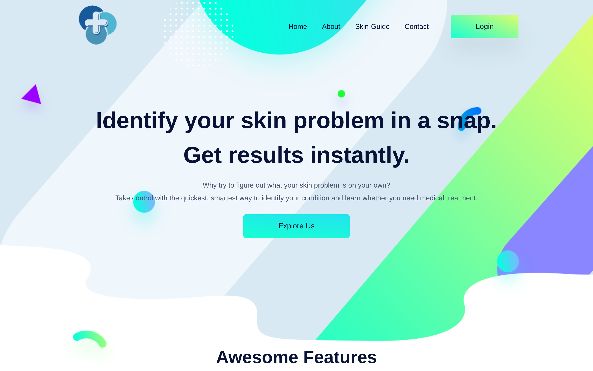
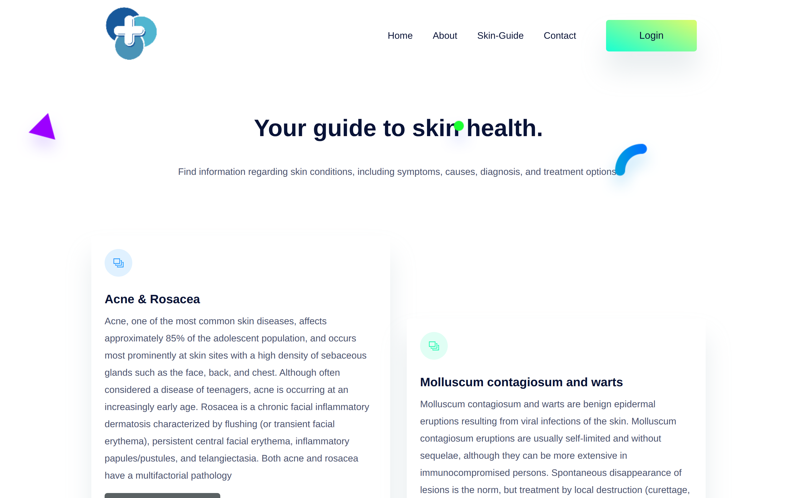
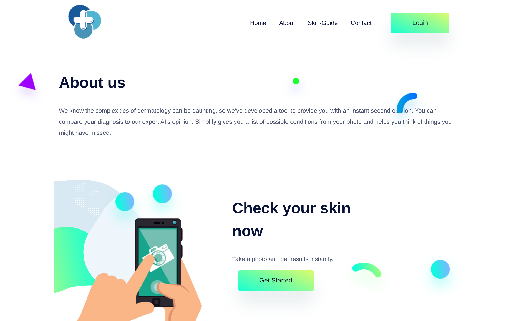
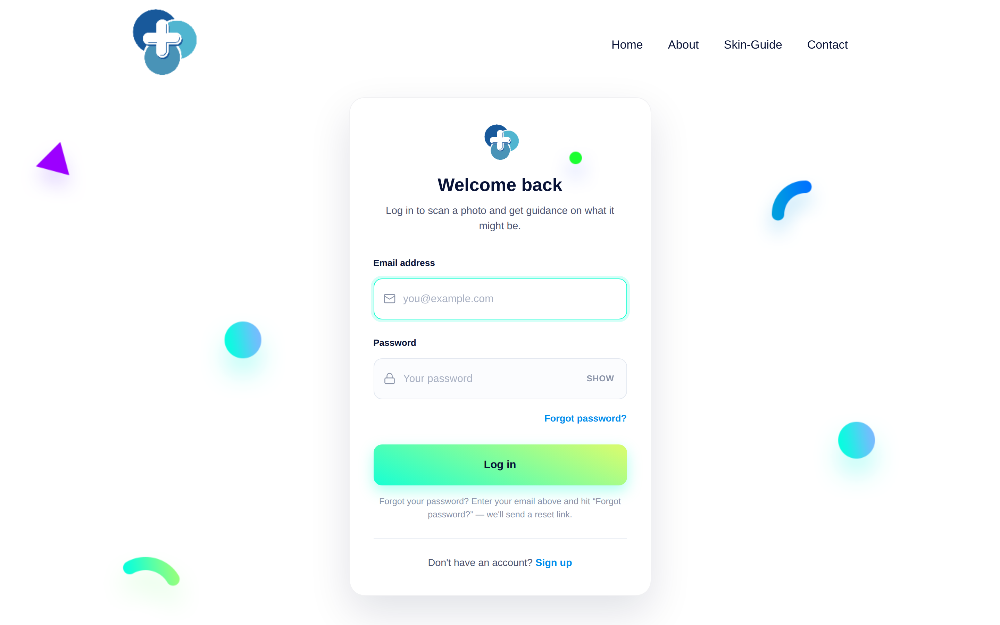
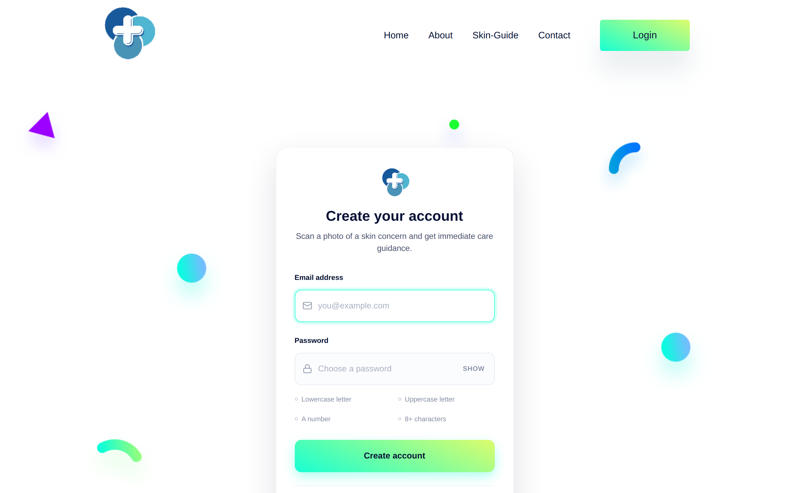
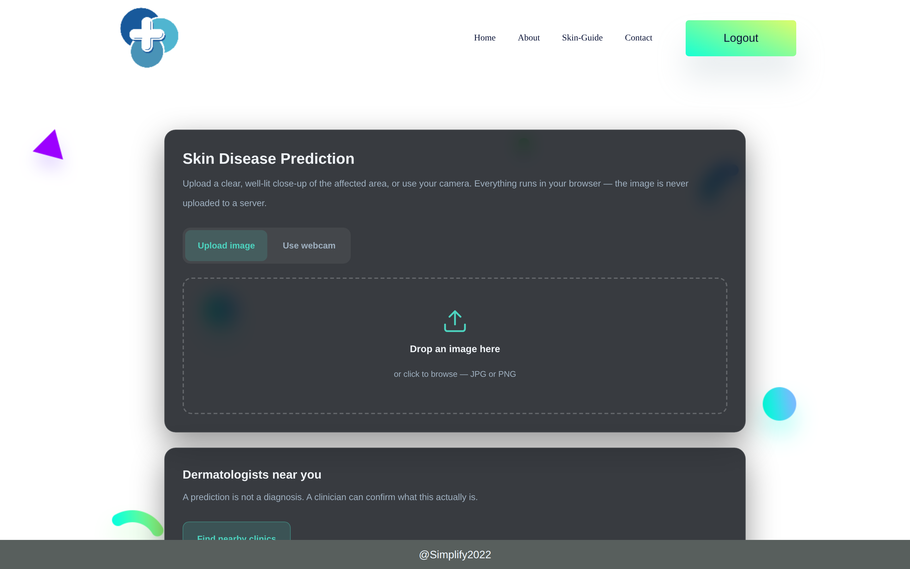
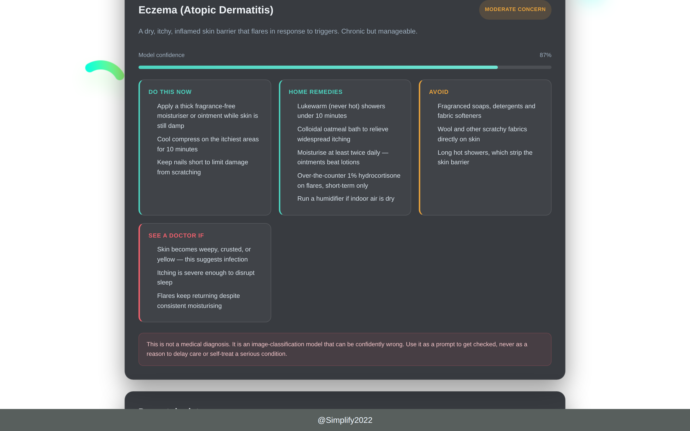

# Simplify

A web app that identifies likely skin conditions from a photo and tells you what you can
do about it right now — immediate care, home remedies, what to avoid, and the red flags
that mean you should stop reading and see a doctor.

Classification runs entirely in the browser via a Teachable Machine model, so the photo
never leaves the user's device.

**Live:** [simplify-skin-disease.vercel.app](https://simplify-skin-disease.vercel.app)

> **This is not a medical device.** It is an image classifier that can be confidently
> wrong. Every result is a prompt to get checked — never a reason to delay care or to
> self-treat something serious.

---

## Screens

### Home


### Skin Guide
Reference material on the conditions the model is trained to recognise.



### About


### Log in


### Sign up
Password requirements tick off live as you type.



### Prediction
Drag-and-drop or webcam capture, with distinct model-loading and scanning states.



### Result and guidance
Shown here with sample data to illustrate the layout.



---

## Features

- **Email/password auth** via Firebase, with sessions that persist for 7 days
- **In-browser classification** — no image upload, no server-side inference
- **Upload or webcam** — webcam predicts on a frame you capture, not continuously
- **Condition guidance** for 20 conditions: immediate care, home remedies, what to
  avoid, and when to seek medical help
- **Severity routing** — anything cancer-adjacent skips home remedies entirely and
  directs to urgent care
- **Confidence reporting**, with an explicit warning below 60%

## Model

A [Teachable Machine](https://teachablemachine.withgoogle.com/) image model with seven
classes:

| Class | Guidance shown |
|---|---|
| Acne and Rosacea | Acne & Rosacea |
| Molluscum contagiosum and warts | Molluscum Contagiosum / Viral Skin Infection |
| Melanoma | Possible skin cancer — urgent |
| Vascular Tumor | Vascular Tumour |
| Eczema | Eczema (Atopic Dermatitis) |
| Bullous | Bullous Disease — urgent |
| Psoriasis and lichen | Psoriasis |

Labels are matched loosely against `static/assets/js/remedies.js`, so variants like
`"Atopic Dermatitis"` or `"Tinea Corporis"` resolve correctly. An unrecognised label
falls back to a generic card rather than breaking the page.

## Stack

| Layer | Choice |
|---|---|
| Backend | Flask, deployed as a Vercel serverless function |
| Auth | Firebase Authentication (REST API) |
| Model | Teachable Machine + TensorFlow.js, client-side |
| Frontend | Jinja templates, vanilla JS, no build step |

## Layout

```
api/index.py              Flask app — all routes, the serverless entry point
templates/                Jinja templates
static/assets/js/
  skin-scan.js            Upload, webcam capture, model loading, result rendering
  remedies.js             Condition guidance and label matching
  auth.js                 Password toggle, live rules, submit state
static/assets/css/
  auth.css                Login and signup
vercel.json               Serverless build and routing
```

`app.py` in the repo root is the original single-file version, kept for local
reference. Vercel serves `api/index.py`.

## Running locally

```bash
python3 -m venv .venv
source .venv/bin/activate
pip install -r requirements.txt

export SECRET_KEY="$(python3 -c 'import secrets; print(secrets.token_hex(32))')"
python api/index.py
```

Then open http://127.0.0.1:5000.

## Deploying

Pushing to `main` triggers a Vercel build. `vercel.json` routes everything to the
Python function except `/static/*`, which is served from the CDN, and `includeFiles`
ensures the templates are bundled into the function.

### Environment variables

| Name | Required | Purpose |
|---|---|---|
| `SECRET_KEY` | Yes, in production | Signs session cookies. Without it the app falls back to a default that is committed to this repo, which means anyone could forge a session. Generate one with `python3 -c "import secrets; print(secrets.token_hex(32))"`. |

The Firebase Web API key in `api/index.py` is intentionally public — that is how Firebase
web keys work. Access is controlled by Firebase security rules, not by hiding the key.

## Known limitations

- `/map` renders `map.html`, which does not exist in `templates/` — the route returns a
  500. Nothing links to it.
- Model accuracy is bounded by its training set. Treat low-confidence results as noise.

## Licence

MIT — see [LICENSE](LICENSE).
